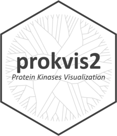

<!-- README.md is generated from README.Rmd. Please edit that file -->

# prokvis2 

<!-- badges: start -->

[](https://github.com/yasche/prokvis2/actions/workflows/R-CMD-check.yaml)

<!-- badges: end -->

The goal of prokvis2 is to provide an easy-to-use Shiny application to
create intuitive visualizations of kinome data similar to KinMap (Eid et
al. 2017) and CORAL (Metz et al. 2018). What is unique about prokvis2 is
its ability to visualize the kinomes of several model organisms,
including mouse, fruit fly and baker’s yeast, besides that of humans.

Kinase data was derived from several publications, including (Caenepeel
et al. 2004) and (Manning et al. 2002), and is redistributed with kind
permission from Gerard Manning (<https://manninglab.org>).

## Installation

You can install the development version of prokvis2 from
[GitHub](https://github.com/) with:

``` r
# install.packages("pak")
pak::pak("yasche/prokvis2")
```

## Example

prokvis2 has one central user-facing function, `run_app()`, that
launches the Shiny application:

``` r
library(prokvis2)

# Start the app with the internal `kinome_data` object:
run_app()

# Start the app with a user-supplied `kinome_data` file:
run_app(custom_kinome_data = "path/to/kinome_data.rds")
```

## References

<div id="refs" class="references csl-bib-body hanging-indent"
entry-spacing="0">

<div id="ref-caenepeel2004" class="csl-entry">

Caenepeel, Sean, Glen Charydczak, Sucha Sudarsanam, Tony Hunter, and
Gerard Manning. 2004. “The Mouse Kinome: Discovery and Comparative
Genomics of All Mouse Protein Kinases.” *Proceedings of the National
Academy of Sciences* 101 (32): 11707–12.
<https://doi.org/10.1073/pnas.0306880101>.

</div>

<div id="ref-eid2017" class="csl-entry">

Eid, Sameh, Samo Turk, Andrea Volkamer, Friedrich Rippmann, and Simone
Fulle. 2017. “KinMap: A Web-Based Tool for Interactive Navigation
Through Human Kinome Data.” *BMC Bioinformatics* 18 (1): 16.
<https://doi.org/10.1186/s12859-016-1433-7>.

</div>

<div id="ref-manning2002" class="csl-entry">

Manning, G., D. B. Whyte, R. Martinez, T. Hunter, and S. Sudarsanam.
2002. “The Protein Kinase Complement of the Human Genome.” *Science* 298
(5600): 1912–34. <https://doi.org/10.1126/science.1075762>.

</div>

<div id="ref-metz2018" class="csl-entry">

Metz, Kathleen S., Erika M. Deoudes, Matthew E. Berginski, Ivan
Jimenez-Ruiz, Bulent Arman Aksoy, Jeff Hammerbacher, Shawn M. Gomez, and
Douglas H. Phanstiel. 2018. “Coral: Clear and Customizable Visualization
of Human Kinome Data.” *Cell Systems* 7 (3): 347–350.e1.
<https://doi.org/10.1016/j.cels.2018.07.001>.

</div>

</div>
